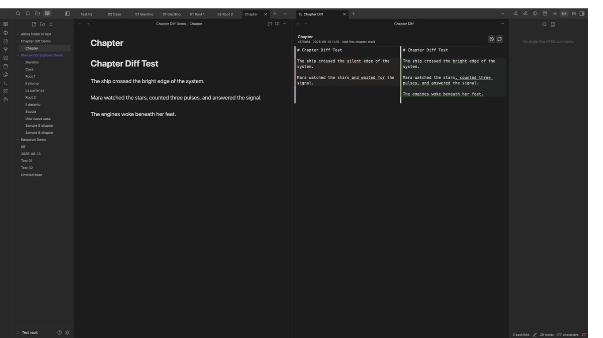

# Chapter Diff

Chapter Diff shows exactly what changed between the note you are editing and
any earlier version saved in Git. The past revision appears on the left, the
live note appears on the right, and additions and removals are highlighted
inline.

It is designed for long-form writing: choose the version you want on the
left, then continue drafting directly in the editable Working Tree on the
right. You can also keep the note open in a normal editor tab; the comparison
stays in sync.



## What it does

- Lists the Git history of the active note.
- Replaces the note's current tab with a two-column comparison, preserving
  navigation back to the note.
- Keeps the selected revision read-only and makes the Working Tree editable.
- Highlights removed text in red and added text in green.
- Collapses long unchanged ranges into clickable “unchanged lines” bars.
- Saves edits made in the right-hand pane back to the note automatically.
- Refreshes the comparison when the same note changes elsewhere in Obsidian.
- Lets you switch revisions without closing the diff pane.
- Continues to find older versions when a note was renamed in Git.

Chapter Diff writes only the note you edit in its right-hand pane. It never
stages, commits, pushes, switches branches, or rewrites Git history.

## Requirements

- A desktop vault that is (or lives inside) a Git working tree — for
  example one already versioned with [obsidian-git](https://github.com/vinzent03/obsidian-git).
- `git` installed and available on your system `PATH`. Chapter Diff shells
  out to your system Git; it does not bundle or depend on obsidian-git's
  internals.
- Desktop only. Reading arbitrary commits requires Node's `child_process`,
  which is not available on mobile.

The Obsidian Git plugin is optional. It is a convenient way to create and sync
commits, but Chapter Diff talks directly to the Git installation on your
computer and does not depend on Obsidian Git.

## Installation with BRAT

1. Install and enable [BRAT](https://github.com/TfTHacker/obsidian42-brat).
2. Open **Settings → BRAT**.
3. Select **Add beta plugin**.
4. Enter `beppepic/chapter-diff`.
5. Keep **Enable after installing** selected and choose **Add plugin**.

You can also run **BRAT: Plugins: Add a beta plugin for testing** from the
Command Palette and enter the same repository identifier.

After installation, open a note with Git history and run **Chapter Diff:
Compare current file with a past revision** from the Command Palette.

## Usage

1. Open the note you want to compare.
2. Run **Chapter Diff: Compare current file with a past revision** from the
   Command Palette.
3. Pick a commit from the file's history.
4. The current tab becomes a two-column diff showing that commit on the left
   and the file's current content on the right, with changes highlighted.
5. Edit the Working Tree directly in the right-hand column. Changes are saved
   to the note automatically. You can also keep writing in a normal editor
   tab, and the diff updates from there.
6. Use the panel's toolbar to switch to a different revision or force a
   refresh. Use Obsidian's back button to return to the normal note view.

## How it works

Chapter Diff reads Git history with `git log` and `git show`; it never stages,
commits, or pushes anything. The "current" side of the comparison is the
actual note in the Obsidian vault. Editing the right-hand column updates that
note, so Git sees the result as an ordinary Working Tree change.

## Development

```bash
pnpm install
pnpm dev     # watch build
pnpm build   # type-check + production build
pnpm test    # unit tests
pnpm lint    # eslint
```

Symlink (or copy) `main.js`, `manifest.json`, and `styles.css` into
`<vault>/.obsidian/plugins/chapter-diff/` to test in a real vault.

## Manual installation

Download `main.js`, `manifest.json`, and `styles.css` from the
[latest release](https://github.com/beppepic/chapter-diff/releases/latest).
Place them in `<vault>/.obsidian/plugins/chapter-diff/`, reload Obsidian, and
enable **Chapter Diff** under **Settings → Community plugins**.
